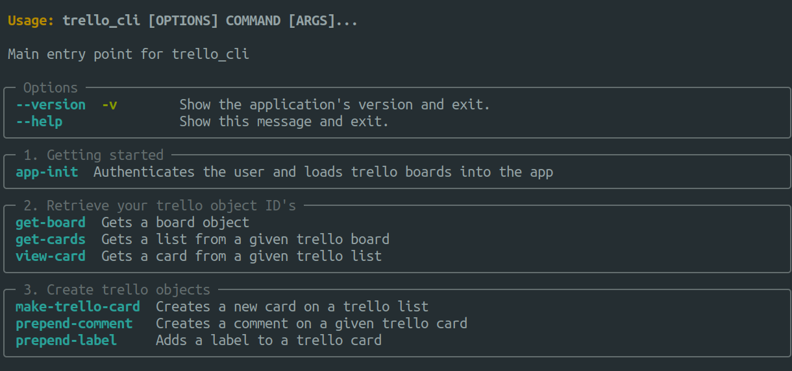
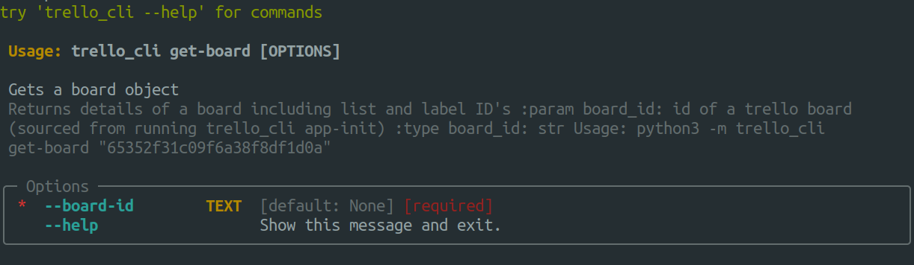

# Overview

A python CLI program for adding cards to a trello board. Given a board specified by the user:

- Add a trello card to a list
- Add labels to a card
- Add a comment to a card

#### Future features:

- Filter closed trello objects
- Delete trello objects from account
- Render trello objects in the terminal

## Requirements

- Python 3.6 or higher
- Trello API key, token and secret (
  see [here](https://developer.atlassian.com/cloud/trello/guides/rest-api/api-introduction/) for more information)

## Installation

1. Clone the repository
2. Install the requirements: `pip install -r requirements.txt`
3. Create a `.env` file in the root directory of the project and add the following variables:

```bash
TRELLO_API_KEY = <your_trello_api_key>
TRELLO_API_TOKEN = <your_trello_api_token>
TRELLO_API_SECRET = <your_trello_api_secret>
```

## Usage

#### 1. Run the package
  - `python3 -m trello_cli --help` to see the available commands and options
  
  - To see what arguments a command takes, run the command with the `--help` flag
  

#### 2. Retrieve ID's 
  - Retrieve a board ID 
    - `python3 -m trello_cli app-init` to initialize and load the user's trello board and label ID's  
  - Retrieve a list or label ID: `python3 -m trello_cli get-board <board_id>` 
  - Retrieve a card ID: `python3 -m trello_cli get-cards <list_id>`

#### 3. View a card 
  `python3 -m trello_cli view-card`

#### 4. Add a card 
  - `python3 -m trello_cli make-trello-card` and enter the list_id and a card name when prompted

#### 5. Prepend a comment to a card 
  - `python3 -m trello_cli prepend-comment` and enter card_id and comment text when prompted

#### 6. Prepend a label to a card
  -`python3 -m trello_cli prepend-label` and enter card_id and label_id when prompted 
  - Note: the label_id and the card_id must belong to the same trello_board


     


